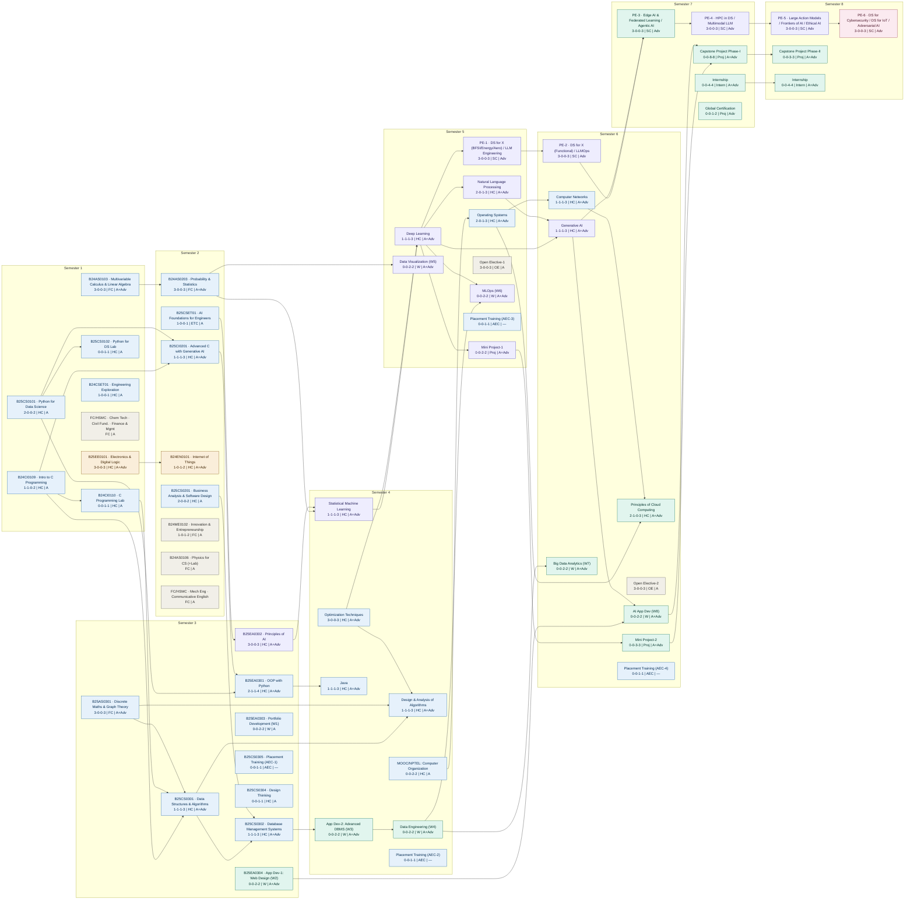

# B.Tech AIDS 2026 — Visual Curriculum Map

A semester-by-semester map of the AIDS 2026 scheme. **Each column is one semester.** Arrows show **prerequisite dependencies** (course at arrow tail is assumed knowledge for course at arrow head). Node colours encode **SIG alignment** (which Special Interest Group / specialization track a course feeds).

## How to read each node

Every node packs five facts:

```
CODE · Title
L-T-P-C | Category | Level
```

- **L-T-P-C** — Lecture-Tutorial-Practical-Credits
- **Category** — FC / HC / SC(PEC) / OE / ETC / MC / W (workshop) / AEC / Proj / Intern
- **Level** — A = awareness-floor course · Adv = has advanced ceiling · A+Adv = both · — = not graded on the dual-level scale (MC/AEC)

## SIG colour legend

| Colour | SIG / track |
|---|---|
| 🟦 Blue | Foundations & CSCore (common spine, placement-critical) |
| 🟪 Purple | AI/ML & Data Engineering SIG |
| 🟩 Teal | Agentic AI / Enterprise Applications SIG |
| 🟧 Amber | IoT · Blockchain · Process Automation SIG |
| 🟥 Pink | Cybersecurity Services SIG |
| ⬜ Grey | Humanities / Mandatory / Open (no SIG, no hard prereqs) |

---

## Curriculum dependency map



---

## Notes on the map

**Dependencies shown are academic prerequisites**, not administrative sequencing. An arrow means the source course supplies knowledge the target course assumes. Soft or motivational links (e.g. Design Thinking → projects) are omitted to keep the prerequisite signal clean.

**Three backbone chains** are visible if you trace the arrows:

- *Programming → OOP → Java* (the language/software spine, blue → feeding AI/ML).
- *Calculus → Probability → Statistical ML → Deep Learning → NLP / Generative AI* (the AI/ML spine, purple).
- *DBMS → Advanced DBMS → Data Engineering → Big Data / AI App Dev → Capstone* (the data/enterprise spine, teal).

**SIG colour reflects where a course leads**, not only what it teaches. Foundation and CSCore courses are blue because they are the common placement-critical spine every SIG depends on; the professional electives fan out into their SIG colours from Semester 5 onward, which is exactly where students choose tracks (informed by performance feedback, per the strategy).

**Professional electives (PE-1…PE-6)** each list their T1/T2 choices in the node. The colour assigned is the *dominant* SIG, but several electives are genuinely cross-SIG — e.g. PE-6 (DS for Cybersecurity / DS for IoT / Adversarial AI) spans the Cybersecurity and IoT SIGs; it is coloured by its cyber option here.

**Greyed/condensed nodes** (humanities, mandatory courses, physics, open electives) carry no hard prerequisites and no SIG alignment, so they are shown condensed rather than as separate dependency nodes — including Indian Constitution & Cyber Law, Environmental Science, Universal Human Values, Professional Ethics, IKS, and the AEC placement-training thread (which runs every semester 3–6 as the CSCore spine).

**Workshops (W1–W8)** appear as graded nodes because in this scheme they carry credits and have real prerequisites — but recall their titles are *indicative*: the SIG teams design the actual content just-in-time, so the arrows show the skill dependency, not a frozen syllabus.
